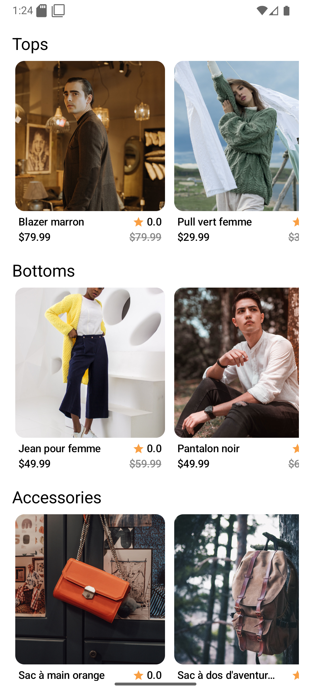
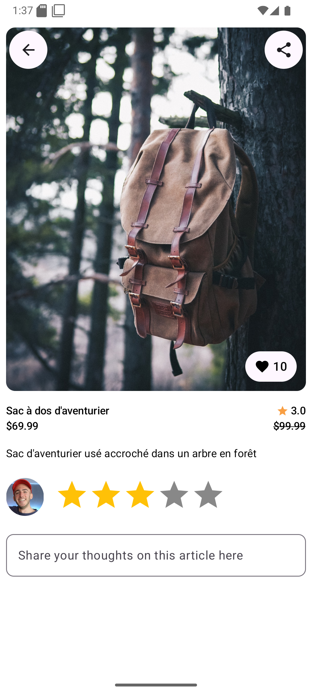
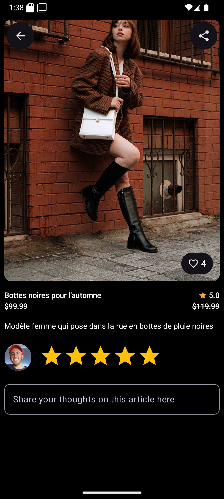
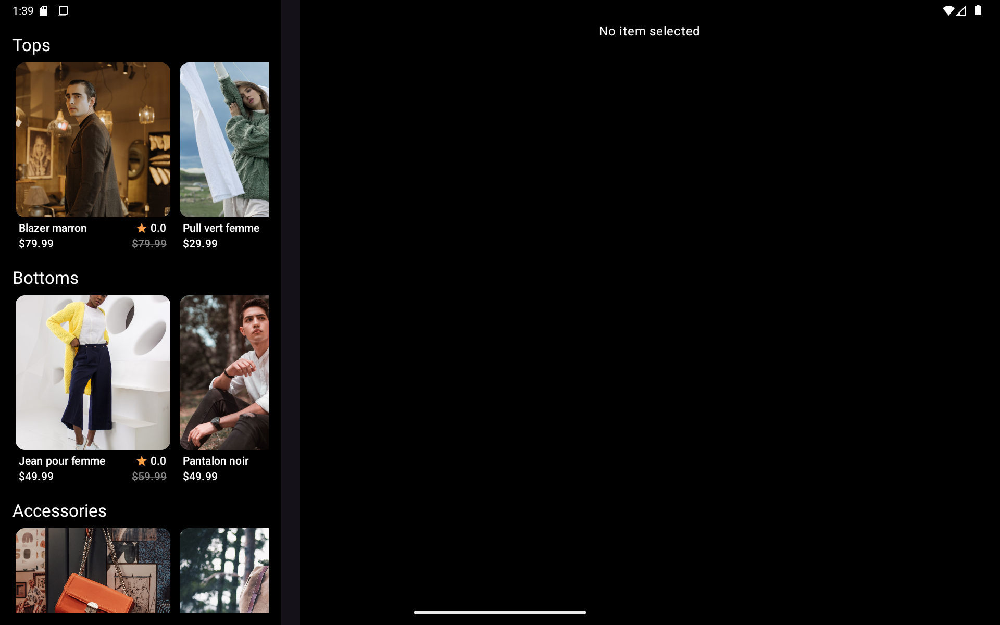
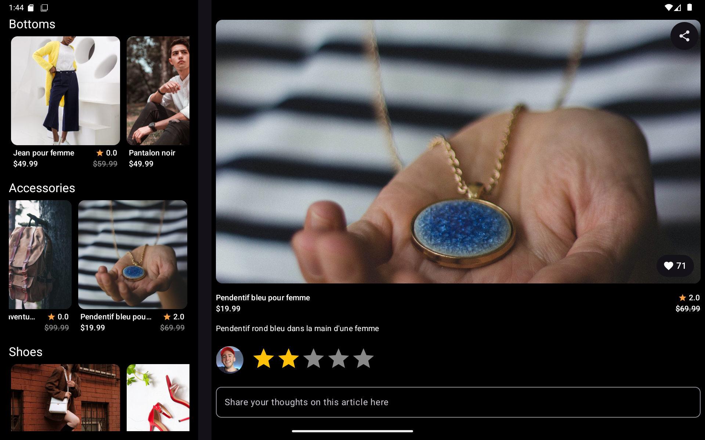

# Joiefull

Joiefull is a showcase Android application built with **Kotlin** and **Jetpack Compose**.  
It displays a collection of clothes that users can **browse, favorite, rate, and comment on**.  
The app retrieves its data from a remote **API** and follows modern Android development practices with accessibility and testing in mind.

---

## ✨ Features
- 📱 **Clothing showcase**: Browse a catalog of clothes.
- ⭐ **Favorites**: Mark your preferred clothes as favorites.
- 📝 **Reviews**: Add a rating and a comment for each item.
- 🖥️ **Adaptive layout**: On tablets or in landscape mode, clothing details are displayed on the right side of the screen (master–detail pattern).
- ♿ **Accessibility compliant**: UI designed to meet accessibility standards.

---

## 🛠️ Tech Stack
- **Language**: Kotlin
- **UI**: Jetpack Compose
- **Image loading**: [Coil](https://coil-kt.github.io/coil/)
- **Networking**: [Retrofit](https://square.github.io/retrofit/) + [Moshi](https://github.com/square/moshi) for JSON parsing
- **Dependency Injection**: Hilt (via DI modules)
- **Testing**:
    - [JUnit](https://junit.org/junit5/) for unit tests
    - [MockK](https://mockk.io/) for mocking dependencies

---

## 📂 Project Structure
```
com.openclassrooms.joiefull
│
├── data
│   ├── model          # Data Transfer Objects (DTOs)
│   ├── network        # Retrofit API services
│   └── repository     # Repository layer (with FakeData for testing)
│
├── di                 # Dependency Injection modules
│
├── domain             # Domain models
│
├── ui
│   ├── theme          # Theming (colors, typography, shapes)
│   ├── DetailPane     # Detail screen (adaptive detail view)
│   ├── ListPane       # List screen (catalog view)
│   ├── MainActivity   # Entry point
│   └── MainViewModel  # ViewModel for UI state management
│
└── JoiefullApp.kt     # Application setup
```

---

## ✅ Testing
- **JUnit** for unit testing
- **MockK** to mock dependencies
- **Turbine** to collect and test Kotlin Flow emissions

---

## 📸 Screenshots

<p align="center">
  
  
  
</p>

<p align="center">
  
  
</p>

- Home screen
- Detail screen (phone)
- Detail screen (tablet / landscape)
- Favorites

---

## 🚀 Getting Started
1. Clone the repository
2. Open the project in **Android Studio**
3. Run the app on an emulator or a physical device (Android 8.0+ recommended)
